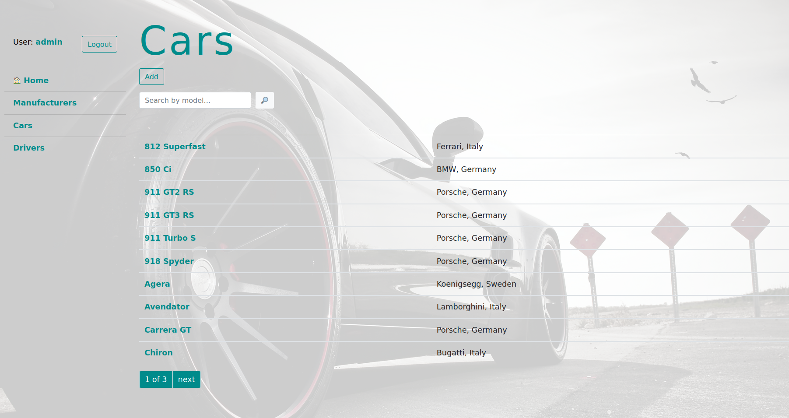

# Taxi Service

Django project for managing Taxi Service

## Check it out!

[Taxi service project deployed to Heroku](https://taxi-service-alix.herokuapp.com/)

## Installation

Python3 must be already installed
```shell
git clone https://github.com/alix-mak/py-taxi-service
python3 -m venv venv
source venv/bin/activate (on macOS) & venv\Scripts\activate (on Windows)
pip install -r requirements.txt
python3 manage.py makemigrations
python3 manage.py migrate
python manage.py runserver # starts Django Server
```

## Features
* Authentication functionality for Driver/User
* Managing cars, manufacturers, drivers directly from website interface
* Powerful admin panel for advanced managing

## Demo


